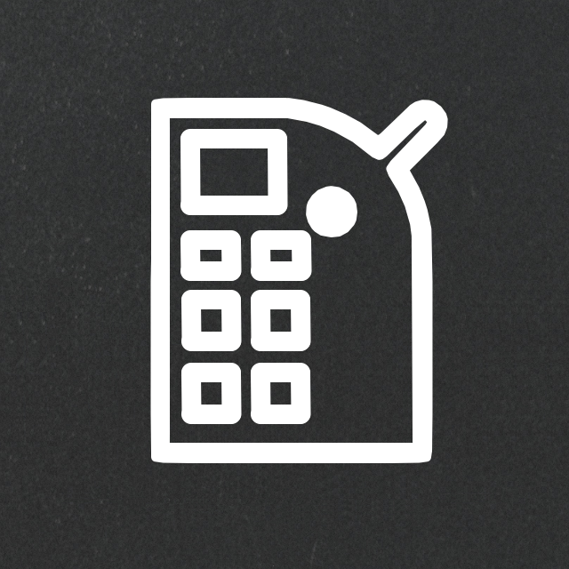

# Pandoracube Accounting Bot

> 동아리 회계 업무를 도와주는 업무자동화 서비스

![version] ![license] ![support]

세종대학교 게임 개발 동아리 판도라큐브의 회계 업무를 도와주는 업무 자동화 서비스입니다.   
카카오톡 채널 ChatBot 서비스와 Google Apps Script를 이용한 Spreadsheet 조작 등의 기능으로 이루어져 있습니다.  
  
사용자가 동아리 회비 납부 확인을 카카오톡 챗봇으로 처리 하면, 자동으로 구글 스프레드 시트에 내역을 작성해주는 주요 기능이 있습니다.

## 개발 환경

Develop with Atom Editer, Kakao i open builder

Period : 19.06 ~ 20.02

## 개발 내역

19.06 : v1.0 배포 - 회비 입력, 시트 기록 자동  
19.09 : v1.2 업데이트 - 유저 경험 수정, 동아리내 식품 산업 장부 기능 추가   
19.11 : v1.5 업데이트 - 유저 경험 개선, 기능 추가 및 유지보수 용이하게 유저 데이터 구조 변경
20.02 : 코로나 바이러스로 인한 동아리 회계 업무 정지에 따른 서비스 중단

## 개발 인원 정보

### [Moon juhan](https://github.com/MoonJuhan)

Kakaotalk ChatBot Node.js Server, Google Apps Script Developer

[version]: https://img.shields.io/badge/version-v1.5-green
[license]:https://img.shields.io/badge/license-MIT-blue.svg
[support]: https://img.shields.io/badge/support-End-black
